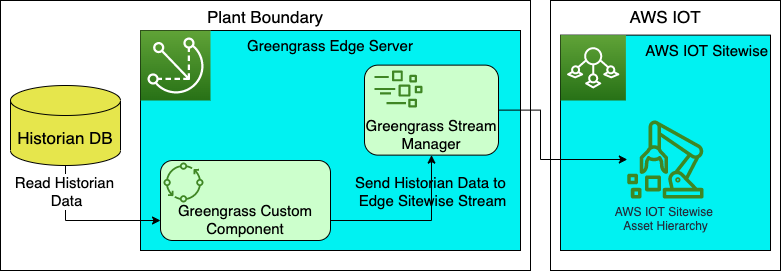

# Greengrass Custom Component for Historian data ingestion into AWS IOT Sitewise
This project provides detail of sample Greengrass custom component developed to send Historian data to [AWS IOT Sitewise](https://aws.amazon.com/iot-sitewise/).
# About the component and over-all solution
The below diagram showcase the over-all solution that can be deployed with this sample:

- Greengrass custom component is deployed at at the edge server inside [AWS IOT Greengrass](https://aws.amazon.com/greengrass/) server
- Greengrass custom component read data from Historian database at a regular interval. Interval will be configured in the code.
- One data is read from Historian database, they are sent to the edge sitewise stream. The stream name is configured in the code. The asset hierarchy along with other asset paramter name and values are read from the Historian database.
- [AWS Greengrass Stream Manager SDK](https://github.com/aws-greengrass/aws-greengrass-stream-manager-sdk-python) is being used to send the historian data to edge sitewise stream.
- From Sitewise edge stream, data is sent to [AWS IOT Sitewise](https://aws.amazon.com/iot-sitewise/) within specific measurement / asset hierarchy, as configured while sending the data to edge stream.
# Pre-requisite for the solution set-up
Following are the pre-requisite before deploying the solution components:
- You have access to AWS account console
- Follow the instructions in sections 1, 2, 3 and 4 of the [IOT Greengrass workshop](https://catalog.us-east-1.prod.workshops.aws/workshops/5ecc2416-f956-4273-b729-d0d30556013f/en-US/chapter4-createfirstcomp/20-step2) to set-up Greengrass Gateway and Asset model.
# Solution instructions
- Create Historian tables as per the SQL scripts included in **CreateTableScript.sql** file
- Run the python code to populate Historian database. The code will run indefinitely, deletng (archiving) data older than 8 hours.
    `# Initialize database related parameters
    db_host_name = "<Enter Host name or IP addres of the Historian DB>"
    db_user = "<User ID of the Historian DB>"
    db_password = "<Password of the Historian DB>"
    db_name = "<Database name>"`
- Configure the Stream manager SDK for Python to create client object:  
`client = StreamManagerClient()`
- Configure Export definition with target to AWS IOT Sitewise
    `exports = ExportDefinition(
            iot_sitewise=[IoTSiteWiseConfig(
                identifier="IoTSiteWiseExport" + stream_name, batch_size=5)]
        )`
- Create AWS IOT Sitewise message stream
    
    `client.create_message_stream(
            MessageStreamDefinition(
                name=stream_name, strategy_on_full=StrategyOnFull.OverwriteOldestData, export_definition=exports
            )
    )`
- Create greengrasssdk.stream_manager.data.AssetPropertyValue Array object for the property values
    
    `asset = [AssetPropertyValue(
                value=variant_data, timestamp=ingestion_time_in_nanos, quality=quality_value)]`
- Contains a list of value updates for a IoTSiteWise asset property.
    
    `asset_property_value = PutAssetPropertyValueEntry(entry_id=str(ID), property_alias=property_alias_str, property_values=asset)`
- Append the asset property into Sitewise stream
    
    `client.append_message( stream_name, Util.validate_and_serialize_to_json_bytes(asset_property_value))`
- For custom component deployment, refer the recipe.json file. To perform deployment, upload artifatc on S3 at a specified location as per below code snippet:
    `s3://<Bucket name>/greengrass/components/aws.workshop.HistorianStreamIngestorIntoSiteWise/1.0.0/historian_data_streamer_sitewise.py`

## Security

See [CONTRIBUTING](CONTRIBUTING.md#security-issue-notifications) for more information.

## License

This library is licensed under the MIT-0 License. See the LICENSE file.

